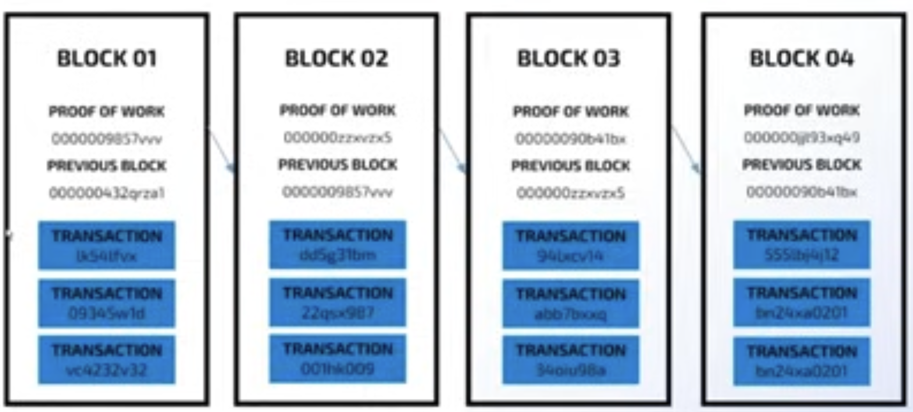
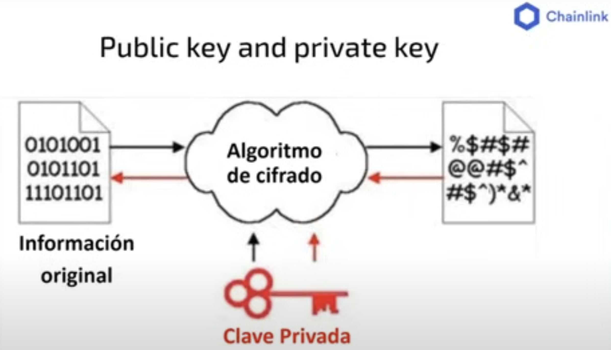
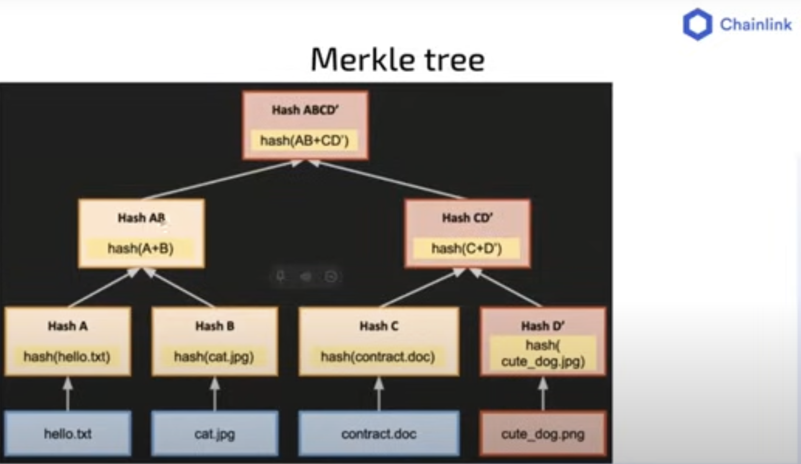

<h2 align="center"> WEB 3.0 </b>🕸</h2>

⛓ [freeCodeCamp](https://www.youtube.com/playlist?list=PLVP9aGDn-X0QRGpzjx3av5lDH6msuAeyU) by @Chainlink

### Chainlink Bootcamp 2024

- Clase #1 | [Conceptos Básicos de Blockchain y Wallets](https://www.youtube.com/watch?v=1SNmVktaagU)

Blackchain. Cadena de bloques 

Trnsacciones y Maquina de estado. 

### Elemento Principales 
1. Criptografia
   a. Hash
     - Algoritmo mapea datos de logitud variable para datos de logitud Fija
     - Sha256 Hash 
     - Detreminista
     - Rapido
     - Unidireccional
     - Resistente a colisiones. 
     
   b. Clave Publica/Privada
    - Claves asimetricas
 

   c. Markle Tree
   - Arbol de hash binario
   - Estrutura de datos
   - Mecanismo antifraude
   - Se usan para Comprimir la transacciones en un bloque

   
2. Teoria de Juegos
   - Decisiones entre individuos
   - Probabilidades
   - Problema de los Generales Bizantinos 
    
3. Sistemas distribuidos
   - Libro mayor distribuidos de estados.

### Conseso
- Proof of work - PoW
- Proof of Stake - PoS
- Proof of Authority - PoA

### Web 3
- [Wallets Metamask](https://metamask.io/)
- [Faucet Chain Link](https://faucets.chain.link/)
- [Sepolia faucet](https://sepolia-faucet.pk910.de/)
- [Sepolia](https://sepoliafaucet.com/)  

- Clase #2 | [Conceptos Fundamentales de Solidity](https://www.youtube.com/watch?v=aPc_jJvPhxw)

- [Remix](https://remix.ethereum.org/)
- [Register](https://sepolia.etherscan.io/address/0x639e2DbE471718c57B524ac771CB0F3A669505F5)
- [RegisterAccess](https://sepolia.etherscan.io/address/0x96dbD625D166D8dA84fD7B03E721F1228B81b2eb) 

- Clase #3 | [Oráculos, Tokens ERC20 y Chainlink Data Feeds](https://www.youtube.com/watch?v=prf1SS1t2hc)

- [The Blockchain Oracle Problem](https://chain.link/education-hub/oracle-problem)

- [Chainlink Data Feeds](https://data.chain.link/)

- [Standards Token](https://ethereum.org/en/developers/docs/standards/tokens/)
- [ERC-20](https://ethereum.org/en/developers/docs/standards/tokens/erc-20/)
- [EIP-20](https://eips.ethereum.org/EIPS/eip-20)
- [Wizard ERC-20](https://wizard.openzeppelin.com/#erc20) 

- Clase #4 | [Cross-chain Tokens Utilizando Chainlink CCIP](https://www.youtube.com/watch?v=6KtafiSU65g)

- 

- Clase #5 | [Sesión de Mentoria con la Comunidad de Chainlink](https://www.youtube.com/watch?v=24Ii_0HjiWo)
